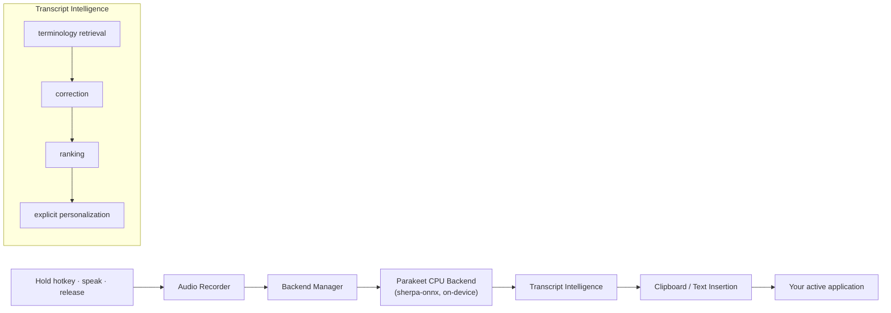
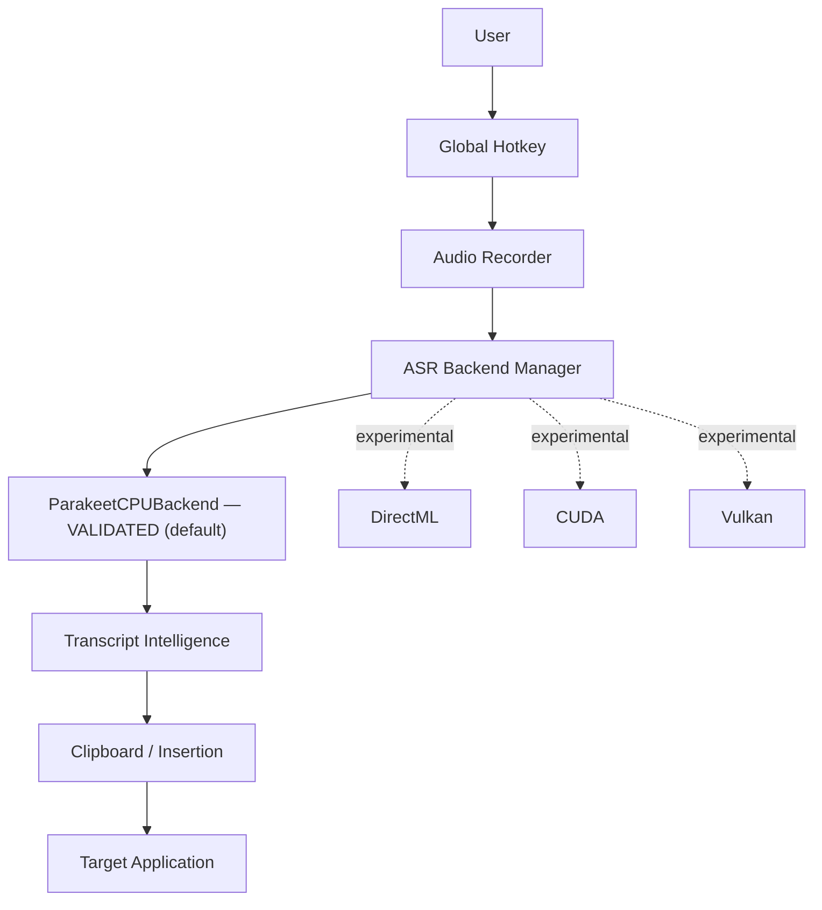

<div align="center">

# SayIt

**Local-first voice typing for your desktop.**

**Authors:** Rahul J, Noah J, and Pranav H

Hold a hotkey, speak, release — your words are transcribed on-device and
inserted at your cursor in any application.

[](LICENSE)
[](#supported-platforms)
[](#models)
[](#privacy)

### [⬇ Download for Windows](https://github.com/VptrCipher/SayIt/releases/latest) · [⬇ Download for Linux](https://github.com/VptrCipher/SayIt/releases/latest) · [🌐 Website](https://vptrcipher.github.io/SayIt/) · [📦 Releases](https://github.com/VptrCipher/SayIt/releases)


</div>

> **Release status:** `v0.1.2` has been **built and released**. The official
> website is **https://vptrcipher.github.io/SayIt/**. See [Release status](#release-status)
> for details.

---

## What is SayIt?

SayIt is a lightweight push-to-talk voice-typing utility for the desktop. You
hold a global hotkey (default **Ctrl + Space**), speak, and release — the
complete utterance is transcribed **on your own machine** by a local
speech-recognition model and the resulting text is inserted at your active
cursor via the clipboard.

It is **not** a cloud dictation service. Core speech recognition runs locally;
network access is only involved for the one-time model download and for an
**optional, off-by-default** cloud text-enhancement feature.

## Why SayIt?

- **Local-first speech recognition** — transcription runs on-device via
  [Sherpa-ONNX](https://github.com/k2-fsa/sherpa-onnx); your audio does not leave
  your computer for recognition.
- **Technical terminology handling** — a deterministic, on-device correction
  layer normalizes developer terms ("git hub" → GitHub, "ci slash cd" → CI/CD)
  and clearly-dictated structured values (URLs, paths, versions), conservatively.
- **Explicit personalization** — user-controlled vocabulary and snippets;
  nothing is learned silently.
- **Transparent correction with safe abstention** — ordinary prose is left
  unchanged; the correction layer is explainable and can be turned off.
- **Desktop-wide insertion** — works across applications through the system
  clipboard + paste.
- **Explicit privacy controls** — cloud enhancement and transcript history are
  both **off by default**.

## Core features

- Push-to-talk recording with a configurable global hotkey.
- On-device transcription (default **Parakeet TDT 0.6B v2 INT8**; optional
  **Whisper Small** higher-accuracy mode).
- Deterministic local technical-term correction and structured formatting.
- User vocabulary, snippets, and context-aware formatting profiles.
- Esc cancellation of an in-progress recording/transcription.
- First-run setup wizard (microphone, model, hotkey).
- System-tray workflow with Ready / Recording / Processing / Error states.
- Optional, opt-in transcript enhancement via a local (Ollama) or cloud LLM.

<div align="center">

&nbsp;&nbsp;

</div>

## How it works



Dictation is **one-shot**: the full utterance is decoded by the local offline
recognizer when you release the hotkey, then the correction layer runs, then the
text is inserted. It is not a streaming/real-time system.

## Architecture

SayIt uses a hardware-adaptive backend abstraction. Only the **CPU backend is
production-validated** today; GPU paths are experimental research and are **not**
active.



> **Experimental:** DirectML/CUDA/Vulkan are research tracks. DirectML
> encoder/joiner GPU execution has been verified in isolation, but complete
> end-to-end Parakeet TDT GPU transcription is **not** validated. `AUTO`
> resolves to **CPU**.

## Privacy

- **Core speech recognition runs locally** on your computer.
- **Cloud enhancement is optional and off by default.** It only sends transcript
  text when you explicitly enable it and configure a remote provider. Audio is
  never sent for enhancement.
- **Transcript history is off by default.** When enabled, completed transcripts
  are stored in a local file.
- **Model download** requires network access and is separate from speech
  recognition — downloading a model is not cloud transcription.
- No analytics or telemetry are added by the project.

SayIt does **not** claim to be "100% private" or "fully offline in every
configuration", because model downloads and optional cloud enhancement involve
the network. See the in-app **Privacy & Data** settings.

## Intelligence / correction

The on-device correction layer is deterministic and explainable: the same input,
context, and settings always produce the same output, and each change is
attributable to a specific rule. It normalizes common technical terms and
clearly-structured values, leaves ordinary prose untouched, abstains when
evidence is weak, and can be disabled. It does not use an LLM, the network, the
clipboard, or screen contents.

## Performance

Measured on one development machine under a warm steady-state benchmark — a
**reference point, not a guarantee** for other hardware.

| Metric | p50 | p95 |
|---|---:|---:|
| ASR (Parakeet int8, warm) | ≈ 739 ms | ≈ 1795 ms |
| Stop → text (ASR + intelligence, excluding insertion and GUI) | ≈ 836 ms | ≈ 2049 ms |

- **Environment:** AMD Ryzen 5 4600G (6c/12t), Windows, CPU inference,
  Parakeet TDT 0.6B v2 INT8, warm (model already loaded).
- **Methodology:** 60 warm runs over fixed benchmark clips. The stop → text
  figure covers ASR plus the on-device intelligence/correction stage; cold model
  initialization (~a few seconds) and the clipboard/paste insertion + GUI
  rendering are measured separately and excluded here.

No "fastest", "best", or "zero-latency" claims are made. Your results will
differ by CPU and utterance length.

## Models

| Role | Model | Notes |
|---|---|---|
| **Default** | Parakeet TDT 0.6B v2 INT8 | On-device transducer; downloaded on first use. |
| **Optional** | Whisper Small | Higher-accuracy mode; slower end-to-end. |

Model weights are **downloaded on demand** (roughly 100 MB–1 GB depending on the
model) into your local app-data folder and are **not** bundled with the
installer. No relative accuracy/speed claim is made between models beyond what
has been measured.

## Installation

### Normal users

The `v0.1.1` release is built and released. Download it from the
[Releases page](https://github.com/VptrCipher/SayIt/releases/latest) or visit
[https://vptrcipher.github.io/SayIt/](https://vptrcipher.github.io/SayIt/). The
release artifacts are built by CI and named:

- **Windows:** `SayIt-Setup-x64.exe` (Inno Setup installer). Unsigned; see
  [Release status](#release-status) for the expected SmartScreen notice.
- **Linux:** `SayIt-0.1.1-Linux-x86_64.AppImage`. Mark it executable
  (`chmod +x`) and run.

Verify your download against the published checksums (`checksums.txt` and the
per-file `.sha256`) on the release page.

Normal users do **not** need Python, a compiler, CUDA, or any SDK.

### From source

```bash
git clone https://github.com/VptrCipher/SayIt.git
cd SayIt
uv sync --frozen
uv run python -m sayit
```

## Supported platforms

| Platform | Status |
|---|---|
| Windows x64 | Tested and launched release target; packaged install + live dictation validated. |
| Linux x64 | AppImage build target; less validated. Hotkey capture may require X11; clipboard needs `xclip`. |
| macOS | Not targeted. |

GPU acceleration (NVIDIA/AMD/Intel) is **experimental research only** and not a
supported production backend.

## Release status

`v0.1.1` is the current **bugfix release**. What is verified:

- ✅ Automated test suite: 916 passed, 5 deselected.
- ✅ Warm performance measured (see [Performance](#performance)).
- ✅ Privacy defaults verified (cloud enhancement + history off by default).
- ✅ Dependencies pinned and reproducible (`uv sync --frozen`).
- ✅ Packaged application and live desktop usage have been tested.
- ✅ SayIt has been launched at **https://vptrcipher.github.io/SayIt/**.
- ✅ Custom hotkeys persist across restarts and are re-registered immediately when changed.
- ℹ️ The Windows installer is unsigned; Windows SmartScreen may show a
  "Windows protected your PC" notice on first run (choose *More info →
  Run anyway*).

## Development

```bash
uv sync --frozen            # install the exact validated environment
uv run pytest -m "not slow" # run the test suite (headless)
uv run python -m sayit      # run the app
```

The validated runtime is **sherpa-onnx 1.13.8 + sherpa-onnx-core 1.13.8**
(pinned together). Do not upgrade either without re-validation.

## Project structure

```
SayIt/
├── src/sayit/            # application package (ASR, intelligence, UI, settings)
├── tests/                # test suite
├── scripts/build.py      # Briefcase build driver
├── website/              # product website (GitHub Pages)
├── installer.iss         # Windows Inno Setup script
└── pyproject.toml        # project + Briefcase configuration
```

## Roadmap

- Hardware-adaptive GPU backends (DirectML first) — pending end-to-end
  validation.
- Further ASR latency optimization.
- Broader platform validation.

These are research directions, not dated commitments; experimental work is not
production-ready.

## Contributing

Contributions are welcome. Please fork, create a feature branch, run
`uv run pytest -m "not slow"`, and open a pull request. See
[`CONTRIBUTING.md`](CONTRIBUTING.md) if present.

## License

SayIt is released under the **MIT License** — see [`LICENSE`](LICENSE).
Model weights and runtime dependencies are governed by their own licenses; see
[`THIRD_PARTY_LICENSES.md`](THIRD_PARTY_LICENSES.md).

## Acknowledgements

- [Sherpa-ONNX](https://github.com/k2-fsa/sherpa-onnx) (Apache-2.0) — on-device
  ASR inference.
- [NVIDIA Parakeet TDT 0.6B v2](https://huggingface.co/nvidia/parakeet-tdt-0.6b-v2)
  (CC-BY-4.0) — default speech model (downloaded, not bundled).
- [OpenAI Whisper](https://github.com/openai/whisper) (MIT) — optional models.
- [PySide6 / Qt](https://www.qt.io/) (LGPLv3) — desktop UI.
